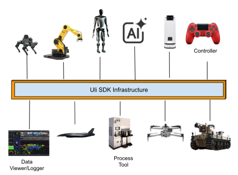
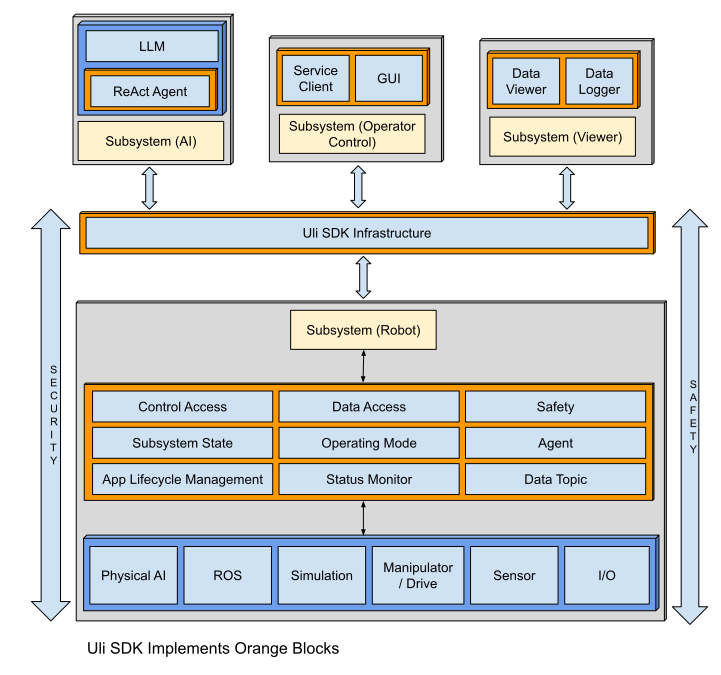
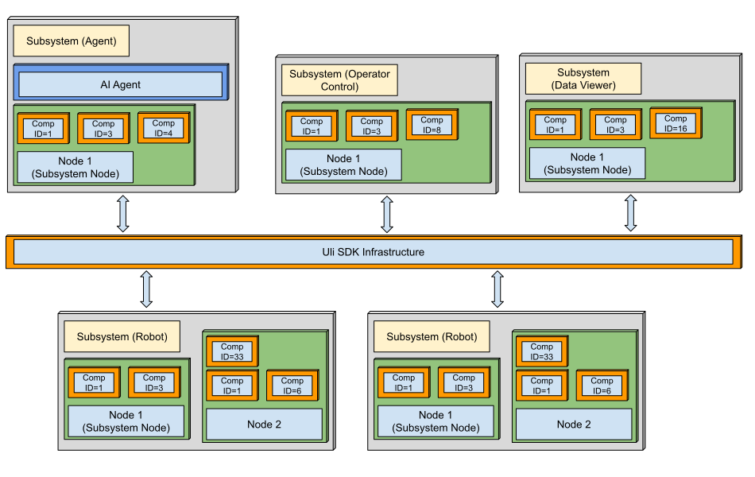
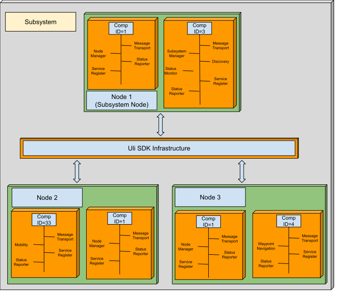
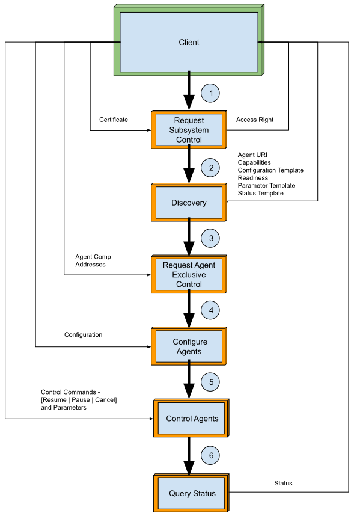
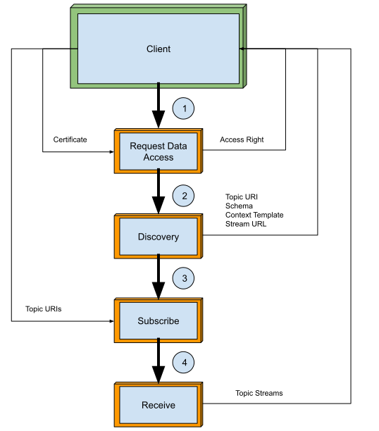

**Uli (Unified Link Interface) SDK** is the robotic nervous system for Agentic AI. It is a high-performance middleware designed to bridge the gap between traditional infrastructures and modern Agentic AI ecosystems. By leveraging the discovery services, Uli SDK enables physical assets to expose their functional capabilities and telemetry as discoverable “context” and “tools” for Language Models.

At the core of the Uli SDK's architecture is a **dynamic**, **self-configuring** infrastructure. This allows functional modules to be discovered, integrated, and utilized at runtime through a set of unified interfaces, eliminating the need for static, pre-configured connections and enabling true system agility.

This powerful infrastructure extends beyond individual modules to connect disparate systems—including **drones**, **autonomous vehicles**, **robot arms**, **process tools**, **controllers**, **AI agents**, and **data viewers/loggers**—that have been integrated using the Uli SDK. The same unified interfaces are leveraged to allow for the dynamic discovery of these complete systems and their functional capabilities and telemetry. This architectural approach is what facilitates true interoperability, enabling seamless collaboration between assets across multiple operational domains.  

To accelerate development and ensure mission-readiness, Uli SDK provides a comprehensive suite of production-ready functional modules. This includes foundational pillars for the **Infrastructure**, **Security**, **Safety**, and **Reliability**, which handle the most critical, non-negotiable aspects of robotic systems. In addition, the SDK offers application-level modules for **Operator Control**, **Data Viewing** and **Logging**, and **Agentic AI**, which can learn and act based on the context of the functional capabilities and telemetry exposed by the assets connected to the infrastructure.

The primary benefit of this modular, pre-built approach is that it empowers robotics developers to focus exclusively on their unique, value-adding logic—the core functional modules that differentiate their product. By providing a robust, pre-validated solution for the complex, non-differentiating aspects of development, the Uli SDK significantly shortens the **development lifecycle**, reduces **project risk**, and accelerates **time-to-market**.

Here is the high-level view of the Uli SDK architecture:  

By adhering to the Department of Defense (DoD) **Modular Open Systems Approach** (**MOSA**), the Uli SDK leverages these unified interfaces in concert with dynamic functional modules. This architecture is the foundation for seamless interoperability, enabling the rapid addition, removal, or reconfiguration of capabilities in response to evolving mission requirements. The result is a highly agile and adaptable system that is built for change.

Building on this foundational interoperability, the Uli SDK empowers the development of sophisticated, LLM-based applications by providing them with crucial, real-world context from the connected robotic systems. Through consistent interfaces to **agents** (functional capabilities) and **data topics** (telemetry), developers can create powerful autonomous **Agentic AI** solutions. These solutions **enhance LLM’s situational awareness to power its cognitive reasoning and acting cycle**, accelerating decision-making and optimizing overall system performance.

The Uli SDK enforces a robust security model to prevent misuse and govern access to all connected assets and their capabilities. At its core is a certificate-based authentication and authorization framework that mandates the strict separation of access rights. Before a client can interact with the system, it must initiate distinct requests and be explicitly granted permissions for **data access** and **control access**. This fundamental separation ensures that a client can only discover and utilize data topics after receiving data permissions, and can only command agents after receiving control permissions, thereby preventing unauthorized operations.

To ensure operational integrity, the Uli SDK incorporates a robust safety framework engineered for the **proactive detection** and **decisive handling** of emergency situations. This is achieved through a redundant triggering system that can activate a coordinated response from multiple sources: automatically, when a safety-critical application enters an ERROR state, and manually, through an operator-initiated e-stop. Upon activation from either trigger, the framework immediately commands all relevant applications to transition into a pre-defined **emergency state**, guaranteeing a swift and reliable response to critical events. 

Reliability in the Uli SDK is architected around a hierarchical state management system. A top-level **Subsystem State** machine governs the entire robotic application by orchestrating the individual **Lifecycle Management** state machines that dictate the behavior of each module. Furthermore, distinct Operating Modes—such as Standard-Operating, Reduced, or Maintenance—provide granular control, allowing for the fine-tuning of module functions to align with specific operational needs and ensure predictable system behavior.

### **Infrastructure**

The Uli SDK infrastructure organizes all computing resources into a clear hierarchical structure of subsystems, nodes, and components. A subsystem serves as a logical grouping of one or more nodes, where each node represents a physical or virtual computing device. In turn, each node hosts the components (applications) that provide services. All communication between these services is conducted through a robust, message-based interaction model. 

To facilitate seamless communication, every entity within this hierarchy—subsystems, nodes, and components—is assigned a unique identifier. Messages are then addressed using a tuple in the format (Subsystem ID, Node ID, Comp ID), which precisely specifies both the source and destination. This ID assignment is performed dynamically, analogous to a DHCP server assigning IP addresses. The SDK’s Id Allocator service issues unique IDs to subsystems, and once a subsystem is registered, its internal Subsystem Manager service allocates unique IDs to the nodes within its domain.

For efficiency and performance, all messages are serialized using the Cap’n Proto framework before being transmitted between clients and servers via local sockets, UDP unicast, or UDP multicast. To enable logical network segmentation, messages can be assigned to specific partitions, ensuring that only services within the same partition can communicate. This entire communication system is managed by a Node Manager service running on each node. The Node Manager dynamically builds a routing table by learning from the messages it processes, allowing it to forward traffic based solely on Uli identifiers. This sophisticated mechanism abstracts away the underlying network topology and removes any dependency on IP addresses for inter-service communication.

This robust infrastructure provides the foundation for the system's actual functionality, which is delivered through **Services**. A Service is the fundamental building block hosted within a component, and while many services perform internal or background tasks, the Uli SDK elevates two specialized concepts to represent the primary, user-facing capabilities of a robotic system: **Agents** and **Data Topics**. These constructs provide a clear and powerful abstraction for interacting with any connected asset. **Agents** represent the active capabilities of the system—the commands and tasks it can execute. **Data Topics**, in contrast, represent the passive data streams—the states, statuses, and sensor readings that provide situational awareness. The following sections will provide a detailed examination of the architecture and implementation of Services, Agents, and Data Topics.

### **Services**

Within the Uli SDK, a service is the fundamental building block of functionality. Each service's behavior and interface are formally defined by its input/output messages, its internal events, a governing state machine, and a set of configurable parameters. To promote modularity and organization, related services are logically grouped together into a higher-level structure known as a component.

To ensure system-wide discoverability and observability, every component is required to implement two foundational services:

* Service Register: Provides a dynamic discovery mechanism, allowing other services to locate and interact with it at runtime.  
* Status Reporter: Offers a standardized interface for querying the component's operational status, health, and other vital metrics.

### 

  ### **Agents**

Agents are the primary components for executing mission-critical tasks and exercising direct control over system capabilities. The Uli SDK provides a unified interface for the entire agent lifecycle, encompassing discovery, configuration, execution, and real-time status monitoring. Utilizing the subsystem's **Agent Discovery** service, clients can dynamically query an agent's capabilities, current configuration, and operational status, as well as request exclusive control to perform specific tasks.

This agent-based architecture is particularly vital for integrating advanced AI and Large Language Model (LLM) frameworks. In this context, agents function as the critical bridge between the AI's cognitive processes and real-world execution. They provide the essential **tools** for task execution, deliver the **capability** and **mission-readiness** data that support AI-driven workflow reasoning, and supply the **control parameters** and **feedbac**k required for AI models to learn and optimize their processes.

The unified workflow for accessing and controlling agents is outlined below.

1) The client requests control (exclusive) of the subsystem.  
2) The client discovers the authorized agents.  
3) The client requests exclusive control of the agent of interest.  
4) The client configures the agent.  
5) The client controls the agent to run, pause, and cancel.  
6) The client queries the status of the agent.

   ### **Data Topics**

Data Topics are the primary mechanism for categorizing and disseminating real-time data throughout the Uli SDK, operating on a robust publish-subscribe model. The Data Topic services act as publishers, publishing data topics, while clients subscribe to specific topics to receive data streams.

To facilitate this dynamic interaction, the Uli SDK provides a **Data Topic Discovery** service. This allows publishing applications to formally register their available data topics within the subsystem. Through a single, unified interface, clients can then perform both the discovery of and subscription to these topics, enabling seamless, on-the-fly integration with new data sources.

The unified workflow for discovering and accessing Data Topics is detailed below.

1) The client requests data access (none-exclusive) to the subsystem.  
2) The client discovers the authorized data topics.  
3) The client subscribes to data topics of interest.  
4) The client receives the data topic streams.

**Contextual Knowledge Graph**

The Uli SDK acts as the intelligent bridge between an AI’s cognitive reasoning and a robotic system’s physical capabilities. By utilizing the discovery services, the SDK enables assets to export high-fidelity context—including asset context, capability context, and telemetry context—formatted in semantically-rich markdown–serves as the foundational schema for a Live **Knowledge Graph-driven Context Layer** that represents the entire robotic fleet. AI agents can then perform **semantic retrieval** to ground their decision-making in the following processes:

* **Reasoning**: AI agents query the knowledge graph to identify assets with the appropriate **Data Access Privileges** and **Control Availability** for a specific mission.

* **Execution**: From the graph, agents retrieve the exact **Capability Context** required to generate precise configurations and control parameters for the hardware, ensuring mission execution is grounded in high-fidelity system knowledge.

* **State Estimation**: AI agents utilize the **Telemetry Context** and subscribed data topics to perform high-level state estimation. By reasoning over the semantics of the live data stream, the agent maintains an accurate world model of the assets’ physical status, environmental interfaces, and operational health within the Knowledge Graph.

  ### **A2UI (Agent-to-UI) Framework**

  ### 

By leveraging native **Dart-FFI integration**, the Uli SDK enables AI agents to drive real-time, high-fidelity user interfaces directly from telemetry streams. The embedded context specifically identifies the appropriate **Flutter UI Widgets** for displaying complex media or 3D contents, as well as the necessary interfaces for users to input agent configurations and control parameters. This seamless bridge between the backend C++ core and the Dart-Flutter framework allows the AI to manage the entire user experience—from displaying status updates to rendering interactive controls—ensuring that situational awareness is maintained for both the AI agent and the human operator.  
 

### **Security**

To ensure the security of the operation, the Uli SDK implements a robust client authentication and authorization framework that distinctly governs control and data access. The framework enforces the security by requiring clients to initiate distinct requests for control access and data access. For each request, the client must present a valid certification. Upon successful validation, the server grants a tailored set of permissions and issues a corresponding session token: either a data access uuid for data requests or a control access uuid for control requests. The client must then use the data access uuid to subscribe to data topics and the control access uuid to request exclusive control of agents.

### **Safety**

The safety framework implemented within the Uli SDK is engineered to ensure the proactive detection and decisive handling of emergency conditions, thereby safeguarding operational integrity. This system is designed to trigger an emergency state automatically upon the detection of critical faults-such as a safety critical application entering an error state or a complete loss of contact-as well as through direct command by an operator, e-stop pressed.

### **Reliability**

Reliability in the Uli SDK is architected around a hierarchical state management system. A top-level **Subsystem State** machine governs the entire robotic application by orchestrating the individual **Lifecycle Management** state machines that dictate the behavior of each module. Furthermore, distinct Operating Modes—such as Standard-Operating, Reduced, or Maintenance—provide granular control, allowing for the fine-tuning of module functions to align with specific operational needs and ensure predictable system behavior.  
 

### **Integration**

The Uli SDK automatically generates Python bindings for applications, facilitating seamless integration with the **Physical AI**, **ROS**, **Simulations**, **ReAct Agents**, and a diverse array of **Python** frameworks.

### **Development**

### 

Uli SDK develops applications for:

	Devices – X86\_64  
		Nvidia Jetson Nano, Xavier NX, Orin Nano, NX, AGX

	Operating Systems – Ubuntu 18.04 \- 24.04  
				Nvidia Jetpack 4.6, 5.1, 6.2

Here are the Uli SDK supported OS and devices:

| OS           | Device                        | Development Host (x86\_64) |
| :----------- | :---------------------------- | :------------------------- |
| Jetpack 4.6  | Jetson Nano, Jetson Xavier NX | Ubuntu 18.04               |
| Jetpack 5.1  | Jetson Xavier NX, Jetson Orin | Ubuntu 20.04               |
| Jetpack 6.2  | Jetson Orin Nano, AGX Orin    | Ubuntu 22.04               |
| Ubuntu 18.04 | x86\_64                       | Ubuntu 18.04               |
| Ubuntu 20.04 | x86\_64                       | Ubuntu 20.04               |
| Ubuntu 22.04 | x86\_64                       | Ubuntu 22.04               |
| Ubuntu 24.04 | x86\_64                       | Ubuntu 24.04               |

### **Tools**

Uli SDK provides a comprehensive suite of tools to facilitate code generation, building, and application deployment. For code generation, the SDK's utilities are capable of producing concise C++ code for core components such as record structures, messages, services, and applications. It also automatically generates **Python bindings** and **Dart-FFI** to ensure seamless integration with various Python and Dart-Flutter frameworks. Via Dart-FFI, Uli SDK can serve as the back end for Flutter-UI for displaying media contents and 3D drawings. Additionally, developers can leverage the help from **Google Antigravity IDE** and **Claude CLI** that have comprehensive understanding of Uli SDK source codes and build systems, which helps speed up the development.

For the building process, the Uli SDK utilizes Google’s highly efficient build tool, **Bazel**. This tool supports cross-building for multiple architectures, including both x86 and ARM 64-bit systems. To streamline the final phase of the development lifecycle, the SDK also includes shell scripts designed to simplify the staging and deployment of applications across a network of devices.

### **Highlights**

1. **Dynamic and Self-Configuring Infrastructure:** A runtime-adaptive backbone for the seamless integration and orchestration of assets across multi-dimensional operating domains.

2. **Unified Discovery Services:** Standardized interfaces for the real-time discovery of robotic assets, their functional capability context, and deep telemetry semantics.

   

3. **Knowledge Graph Synthesis:** Automated ingestion of discovered Asset, Capability, and Telemetry contexts into a structured Knowledge Graph to support advanced AI reasoning.

   

4. **Python Bindings:** Straightforward integration of ROS, simulations, and machine learning modules, bridging the gap between high-level AI research and physical deployment.

   

5. **Comprehensive Asset State Management:** Granular control over operational states including Initializing, Operational, Emergency, Pause, Shutdown, and Render Useless.

   

6. **Safety-Critical Lifecycle Coordination:** Automated management of functional module lifecycles synchronized with asset operational states.

   

7. **Proactive Health Monitoring:** Real-time application status tracking and health reporting to enforce asset safety by triggering coordinated emergency transitions.

   

8. **Redundant Emergency Propagation:** Multi-path E-Stop propagation architecture to mitigate single-point failures.

   

9. **Versatile Operating Modes:** Built-in support for Standard, Reduced, Training, and Maintenance modes.

   

10. **Zero-Trust Security Model:** Robust certificate-based client authentication and authorization for all system interactions.

    

11. **Tiered Access Governance:** Granular authorization for functional capabilities (Operator/Maintainer) and telemetry data (Classified/Controlled/Unclassified).

    

12. **Native A2UI Integration:** High-performance Dart-FFI bindings for direct integration with Flutter, enabling AI-driven 3D drawings and media displays.  
    

    ### **Advantages**

Uli SDK is engineered to deliver a decisive edge in adaptability, interoperability, and operational integrity. Its architecture provides the following key advantages:

* **Autonomous Agent Interoperability:** Enables AI agents to reason across diverse hardware fleets through unified discovery and dynamic tool configuration.

* **Semantic Knowledge Retrieval:** Provides a "Context Layer" that allows AI agents to perform semantic retrieval from the Knowledge Graph to ground decision-making.

* **Enhanced Situational Awareness:** Powers the AI cognitive "reasoning and acting" cycle by feeding agents with the complete discovered context.

* **High-Level State Estimation:** Allows agents to reason over live telemetry semantics to maintain an accurate world model of physical status and operational health.

* **Accelerated A2UI Development:** The native Dart-FFI framework enables AI agents to drive real-time user interfaces directly from live telemetry.

* **MOSA-Compliant Flexibility:** Adopts the Modular Open Systems Approach to ensure long-term interoperability and the elimination of vendor lock-in.

* **Streamlined AI Workflow:** Integrated Python bindings facilitate immediate connection with ROS and advanced machine learning modules.

* **High Quality:** Quality assurance is embedded throughout the development lifecycle, with continuous review and validation to ensure objectives are met.

* **Cost Effectiveness:** The Uli SDK is delivered as open-source for licensed customers, offering full transparency and eliminating vendor lock-in to provide a low total cost of ownership

Visit our website: [www.ulisdk.com](http://www.ulisdk.com)
