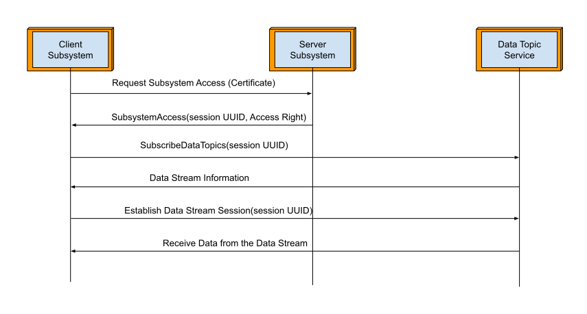
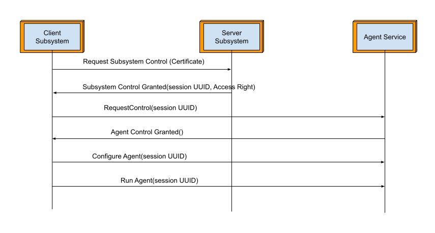
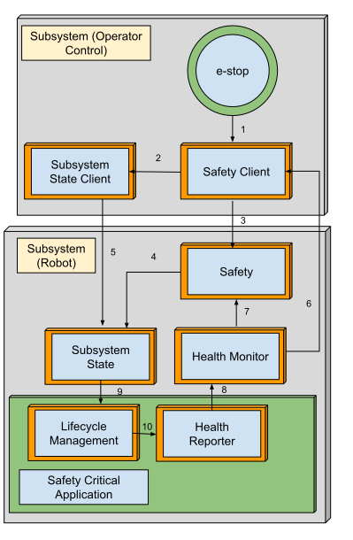
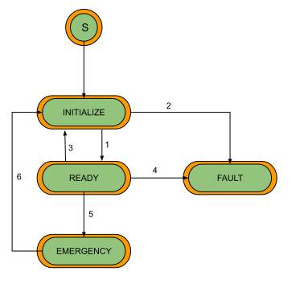
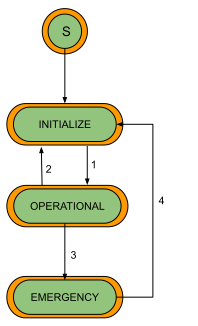
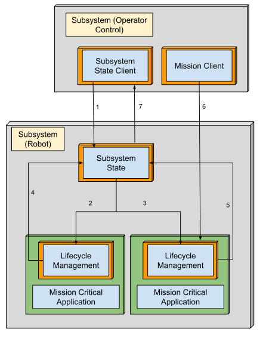
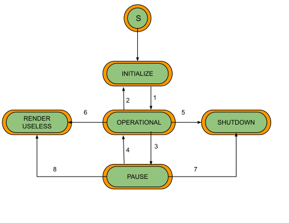

# **Security**

To ensure the security of the operation, the Uli SDK implements a robust server-client authentication and authorization framework that distinctly governs data and control access. The framework enforces the security by requiring clients to initiate distinct requests for data access and control access. For each request, the client must present a valid *certification*. Upon successful validation, the server grants a tailored set of *permissions* and issues a corresponding session token: either a **data access uuid** for data requests or a **control access uuid** for control requests. The client must then use the **data access uuid** to subscribe to data topics and the **control access uuid** to request exclusive control of agents.

To further fortify the security of an established session, the framework enforces a strict session lifecycle management policy. To maintain an active connection, clients are required to periodically resubmit their session uuid to the relevant data or agent servers, acting as a "keep-alive" mechanism that prevents the session from expiring due to inactivity. Furthermore, each session uuid is designed with a finite lifetime. The system automatically generates a new uuid after a predefined period, invalidating the old one. This dual-pronged approach of session timeouts and periodic rotation significantly enhances security by minimizing the attack window for potential session hijacking and ensuring that any compromised token becomes useless in a short amount of time. 

This access control model is scoped at the subsystem level, governing how client subsystems interact with the data and agents of other subsystems. A fundamental distinction is made between the two types of access. Data access is designed as a shared, one-to-many relationship, permitting multiple client subsystems to concurrently subscribe to data topics from a single source. In stark contrast, control access is strictly exclusive. This one-to-one relationship ensures that only a single client subsystem can be granted the privilege to operate the agents of a target subsystem at any given time, preventing conflicting commands and ensuring operational stability. The following sections will examine the specific implementation details of this architecture.

## **Data Access**

The management and enforcement of data access are centralized within the **Subsystem Access** service. This service implements a hierarchical permission model to categorize access rights, granting clients privileges in one of three tiers: **Classified**, **Controlled**, and **Unclassified**. In this model, **Classified** represents the highest level of privilege, while **Unclassified** constitutes the lowest. Each client is assigned a specific access right upon successful authentication, which dictates the scope of data they are permitted to view.

This classification system is fundamental to the framework's data segregation capabilities. When a client with a granted access level attempts to subscribe to data, the framework automatically filters the available data topics, presenting only those that match or fall below the client's authorized privilege level. For example, a client with **Controlled** access will be able to see both **Controlled** and **Unclassified** topics, but will be completely unaware of any topics designated as **Classified**.

The precise event sequence for a client requesting and being granted data access is detailed below.

## **Control Access**

Control access is managed by the dedicated **Subsystem Control** service and is designed to be fundamentally *exclusive*, ensuring that only one client can operate a subsystem's agents at any given time. This exclusivity is enforced through a preemption model based on a numerical *authority code*, which ranges from 1 (lowest) to 255 (highest). If a new client requests control while another is already active, the service will grant access to the client with the higher authority code, automatically revoking the session of the incumbent client.

Upon receiving a control request authenticated by a certificate, the **Subsystem Control** service notifies the client whether the request has been granted or denied. If granted, the service assigns a specific access right from one of three privilege tiers: **Operator**, **Maintainer**, and **Administrator**, with **Administrator** being the highest. Mirroring the data access model, this granted right is used to filter the available agents. The controlling client is only presented with, and can only interact with, agents that correspond to its authorized privilege level, preventing unauthorized operations.

The event sequence for a client requesting and being granted control access is detailed below.

## **Conclusion**

Ultimately, the Uli SDK's security is defined by its strict architectural separation of concerns. This is evident in its distinct services for managing data and control, its use of separate session tokens for each, and its tailored access models: a hierarchical, shared model for data, and an exclusive, preemptive model for control. This foundational design, combined with certificate-based authentication and active session lifecycle management, creates a zero-trust environment where every interaction is explicitly authenticated and authorized, ensuring that access is always granted with precision and purpose.

## 

# **Safety**

The safety framework implemented within the Uli SDK is engineered to ensure the *proactive detection* and decisive handling of emergency conditions, thereby safeguarding operational integrity. This system is designed to trigger an emergency state automatically upon the detection of critical **faults**—such as a safety critical application entering an error state or a complete loss of contact—as well as through direct command by an operator, **e-stop pressed**. The foundational pillars of this framework are *reliability* and *redundancy*. To guarantee uninterrupted monitoring and communication, the architecture mandates redundant entities for assessing safety conditions and redundant routes for propagating health status and operator-initiated emergencies. This safety layer is intrinsically tied to subsystem operations, enabling immediate, appropriate responses while ensuring the operator is kept continuously informed through a consistent feedback loop.

To execute this comprehensive safety strategy, the Uli SDK relies on its architecture of interconnected services working in concert. This ecosystem comprises the **Health Reporter**, the **Health Monitor**, the **Management (Life Cycle)** service, the **Subsystem State** service, the core **Safety Service**, and the **Safety Client Service**. Together, these components form a resilient and responsive system responsible for monitoring, reporting, and acting upon all safety-critical events. 

## **Overview**

The graph below shows the interactions (indicated by arrows) among the participating services:

The arrows in the graph are explained below:

1 e-stop state routed to **Safety Client**

2 emergency decision commanded to **Subsystem State Client**

3 e-stop state reported to **Safety**

4 **Safety** triggers emergency to **Subsystem State**

5 **Subsystem State Client** triggers emergency to **Subsystem State**

6 health summary reported to **Safety Client**

7 health summary reported **to Safety**

**8 Health Reporter** sends application health status to **Health Monitor**

9 **Subsystem State** requests state transition to **Management**

10 application error status reported to **Health Reporter**

The distribution of responsibilities between the **Safety Client**, **Safety Service**, and **Subsystem State Client** is intentional, establishing critical redundancies within the safety framework. This layered approach guarantees redundant reporting of the e-stop state, redundant determination of an emergency condition, and redundant pathways for commanding the subsystem into an emergency state, thereby ensuring that a single point of failure will not compromise the system's ability to enter a safe state.

The following sections will provide a detailed examination of the specific roles and responsibilities of each of these services.

## **Life Cycle Management** 

At the heart of each safety-critical application is a dedicated state machine, inherited from the **Management Service**, that provides robust lifecycle management. This state machine dictates the application's operational mode through four distinct states: **INITIALIZE**, **READY**, **FAULT**, and **EMERGENCY**. While the **INITIALIZE** state handles startup procedures and the **READY** state executes normal commands and operations, the safety framework is primarily concerned with the latter two states.

	

Below are the actions in each of the state:

| State      | Actions                                  |
| :--------- | :--------------------------------------- |
| INITIALIZE | Perform initialize procedures and tests  |
| READY      | Execute commands and operations          |
| FAULT      | Report error through the Health Reporter |
| EMERGENCY  | Perform emergency procedures             |

Within this lifecycle, the **FAULT** and **EMERGENCY** states are integral to safety enforcement. An application enters the **FAULT** state when it encounters an unrecoverable internal error. Its sole action in this state is to report an ERROR status through its **Health Reporter** service, ensuring the subsystem-wide **Health Monitor** service is immediately aware of the anomaly. 

Conversely, the **EMERGENCY** state is entered in response to a subsystem-level directive from the **Subsystem State** service. In this mode, the application ceases normal operations and executes a predefined set of emergency procedures designed to mitigate the critical condition and bring its domain to a safe state.

The following table is the state transitions and their triggers:

| Transition | Trigger                                                                              |
| :--------- | :----------------------------------------------------------------------------------- |
| 1          | Initialization procedures are performed and tests are successful.                    |
| 2          | Unrecoverable faults occur while performing the initialization procedures and tests. |
| 3          | Receive the INITIALIZE state transition request.                                     |
| 4          | Unrecoverable faults occur while executing commands and operations.                  |
| 5          | Receive the SET EMERGENCY state transition request.                                  |
| 6          | Receive the CLEAR EMERGENCY state transition request.                                |

The transitions between these states are governed by specific triggers, with all state transition requests being issued by the **Subsystem State** service. An application moves from **INITIALIZE** to **READY** upon successful startup, but will enter the **FAULT** state if initialization fails or an unrecoverable error occurs during normal operation. A RESET request is required to move an application out of the **FAULT** state, forcing a re-initialization.

Critically, a SET EMERGENCY request will transition a healthy application from **READY** to **EMERGENCY**, while a CLEAR EMERGENCY request will return it to the **INITIALIZE** state, to perform initialization procedures and tests before allowing normal operations to resume.

## **Health Status Reporting and Monitoring**

The foundation of the safety framework's health monitoring capability lies within its safety-critical applications, each of which integrates a **Health Reporter** service. The primary function of this service is to continuously report its operational status to the subsystem's central **Health Monitor** service. This reporting mechanism is pivotal in the detection of fault conditions. When entering FAULT state, the **Life Cycle Management** service immediately signals a health status error to the **Health Monitor**. In response, the **Health Monitor** escalates the issue by setting the subsystem's overall **Health Summary** to an ERROR state. This ERROR status is then propagated to the core **Safety Service** during its routine query of the Subsystem Summary, triggering the system-wide emergency handling procedures.

## **Subsystem State**

Operating at the subsystem level, the **Subsystem State** service functions as the central orchestrator for the lifecycle of all safety-critical applications. It is responsible for monitoring, commanding, and synchronizing the state transitions of the individual **Management** services within its domain. By centralizing this authority, the service ensures that all applications respond cohesively to system-wide operational changes, providing a unified and predictable state across the entire subsystem.

Here is the state machine:

The following table is the state transitions and their triggers:

| Transition | Trigger                                                           |
| :--------- | :---------------------------------------------------------------- |
| 1          | Initialization procedures are performed and tests are successful. |
| 2          | Receive RESET command.                                            |
| 3          | Receive SET EMERGENCY command.                                    |
| 4          | Receive CLEAR EMERGENCY command.                                  |

The **Subsystem State** service acts as the primary interface for both operator-initiated, via the **Subsystem State Client**, and commands from the **Safety** service. For instance, when an operator issues a RESET request, the service translates this into a command that directs all managed applications to re-enter their **INITIALIZE** state. Critically, the command to enter the **EMERGENCY** state can be triggered by two sources: manually by an operator via a SET EMERGENCY request, or automatically by the **Safety** service upon detection of a critical system-wide fault. In either scenario, the **Subsystem State** service ensures that all safety-critical applications are immediately commanded to transition into their **EMERGENCY** state. Recovery from this state is a deliberate action; an operator must issue a CLEAR EMERGENCY request after the underlying condition has been resolved, allowing the system to return to a normal operational state.

## **Safety and Safety Client**

Positioned on the operator side of the architecture, the **Safety Client** service acts as a primary interface for monitoring and initiating safety actions. It is responsible for two key inputs: it directly receives the status of the operator's e-stop control, and it actively queries the **Health Monitor** service to obtain the Subsystem Health Summary. Upon detecting a fault within this summary or receiving an e-stop signal, the **Safety Client** service initiates a critical response by triggering the **Subsystem State Client** to issue a SET EMERGENCY command to the **Subsystem State** service.

In parallel with this action, the **Safety Client** also reports the e-stop state directly to the central **Safety Service**, providing it with crucial, operator-initiated data for its own assessment of the system's safety condition.

## **Conclusion**

In summary, the Uli SDK's safety framework is a testament to a defense-in-depth strategy, designed to eliminate single points of failure. It deliberately distributes the critical responsibilities of monitoring, decision-making, and command execution across an ecosystem of interconnected services. This interplay of services—from the distributed Health Reporter and Safety Client to the central Safety Service and the orchestrating Subsystem State—creates multiple, independent pathways for a critical event to be detected and acted upon. This foundational redundancy ensures that no single service or communication link can prevent the entire system from decisively transitioning into its emergency state, thereby guaranteeing operational integrity.

# **Reliability**

The Uli SDK's approach to reliability is founded on a core principle: tasks are executed only when the system is in a proper, validated state, ensuring that both software and hardware are ready for the operation. To enforce this principle, the SDK implements a sophisticated **two-tiered state machine architecture**. This architecture consists of a **Lifecycle Management** state machine that governs the behavior of each individual mission-critical application, and a top-level **Subsystem State** machine that aggregates these individual states to determine the overall system status and serve as the primary interface to the operator. This layered approach enables applications to meticulously track system states, deterministically process execution commands, and provide clear status feedback, guaranteeing predictable and controlled behavior under all conditions.

## **Overview**

The graph below shows the interactions (indicated by arrows) among the participating services:

The arrows in the graph are explained below:

1 An operator or external system issues high-level commands (RESET, SHUTDOWN, RENDER USELESS) to the Subsystem State service.

2 and 3 The Subsystem State service translates the high-level command into specific directives (Initialize, Shutdown, Render Useless) and sends them down to the individual Lifecycle Management service of each mission critical application.

4 and 5 Each Lifecycle Management service reports its current state back up to the Subsystem State service. The Subsystem State service then aggregates these individual statuses to determine its own transition.

Example: It will transition from INITIALIZE to OPERATIONAL only after all the Lifecycle Management services have reported that they are in a STANDBY or READY state.

6 Mission client engages an Application by continuously sending GO commands to its Lifecycle Management service. This action transitions the application from STANDBY to READY and serves as a keep-alive signal to maintain the READY state during operation.

7 Subsystem State service reports its state back to the Subsystem State Client, providing the operator with a clear, unified view of the system’s current status.

## **Lifecycle Management** 

At the application level, this reliability is realized through the Lifecycle Management state machine framework. Inherited from the Management Service, this framework provides each mission-critical application with a standardized set of states to govern its behavior throughout its entire operational lifecycle. The behavior of an application in each state is strictly defined to ensure safety and predictability:

* Upon startup, the application enters the INITIALIZE state to perform all necessary procedures and self-tests.

* Only after successful validation does it proceed to STANDBY, awaiting engagement, and then to READY, where it executes its core commands and operations.

* Should an unrecoverable error occur, the application transitions to the FAULT state, where its sole responsibility is to report the error via the Health Reporter.

* The lifecycle also includes states for controlled interruptions (PAUSE), orderly termination (SHUTDOWN), and secure decommissioning (RENDER USELESS).

Here is the Lifecycle Management state machine:

The following table is the state transitions and their triggers:

| Transition | Trigger                                                         |
| :--------- | :-------------------------------------------------------------- |
| 1          | Initialization procedures and tests are successfully performed. |
| 2          | Receive INITIALIZE command.                                     |
| 3          | Mission client engages, receive GO command                      |
| 4          | GO command times out                                            |
| 5          | Recoverable error or pause condition is detected.               |
| 6          | Receive CONTINUE command.                                       |
| 7          | Receive SHUTDOWN command.                                       |
| 8          | Receive RENDER USELESS command.                                 |
| 9          | Receive SHUTDOWN command.                                       |
| 10         | Receive RENDER USELESS command.                                 |

## **Subsystem State**

The Subsystem State service acts as the central orchestrator for the entire subsystem, governing its overall behavior and serving as the primary interface for the operator. Its core responsibilities are twofold: it translates high-level operator commands into specific directives for each mission-critical application's Lifecycle Management service, and conversely, it aggregates the individual states reported by each application to determine a unified, overall subsystem state. This aggregated state is then reported back to the operator, providing a clear and authoritative view of the system's operational status.

This behavior is governed by a dedicated state machine with five primary states: INITIALIZE, OPERATIONAL, PAUSE, SHUTDOWN, and RENDER USELESS:

The following table is the state transitions and their triggers:

| Transition | Trigger                                                                   |
| :--------- | :------------------------------------------------------------------------ |
| 1          | All the Lifecycle Management states are either in STANDBY or READY state. |
| 2          | Receive RESET command.                                                    |
| 3          | One of the Lifecycle Management is in PAUSE state.                        |
| 4          | Receive CONTINUE command.                                                 |
| 5          | Receive SHUTDOWN command                                                  |
| 6          | Receive RENDER USELESS command                                            |
| 7          | Receive SHUTDOWN command                                                  |
| 8          | Receive RENDER USELESS command.                                           |

The transition from INITIALIZE to OPERATIONAL is not triggered by a direct command but is an automatic validation step. This transition only occurs once all Lifecycle Management services report they are in either a STANDBY or READY state, confirming that the entire subsystem has successfully initialized.

If even a single application reports a PAUSE condition, the entire subsystem will enter the PAUSE state, requiring an explicit CONTINUE command from the operator to resume.

Direct commands such as SHUTDOWN and RENDER USELESS will move the subsystem into its terminal states from either an OPERATIONAL or PAUSE state.

Finally, a RESET command will return the subsystem to the INITIALIZE state, beginning the startup and validation sequence anew.

## **Conclusion**

Ultimately, the Uli SDK's reliability framework provides a robust mechanism for enforcing operational integrity by decoupling high-level operator commands from low-level application execution. The Subsystem State acts as a gatekeeper and translator, while the Lifecycle Management state machine ensures each application adheres strictly to its defined behavior. This hierarchical control structure prevents unintended actions and guarantees that the entire system behaves as a cohesive, predictable whole.
